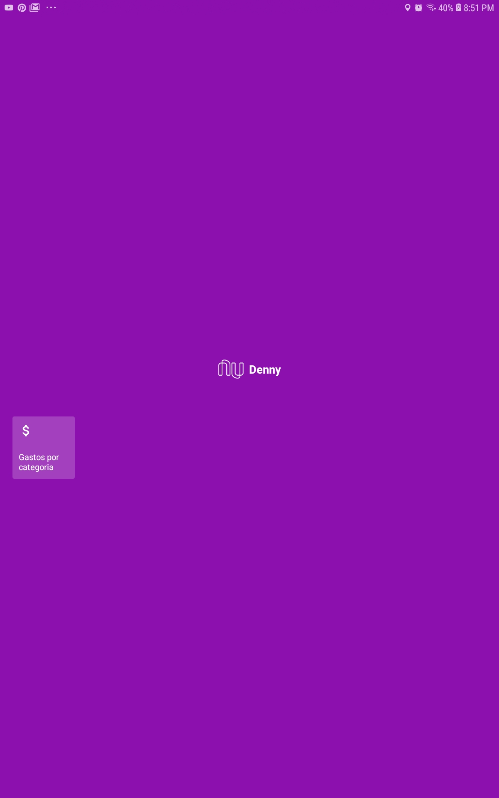
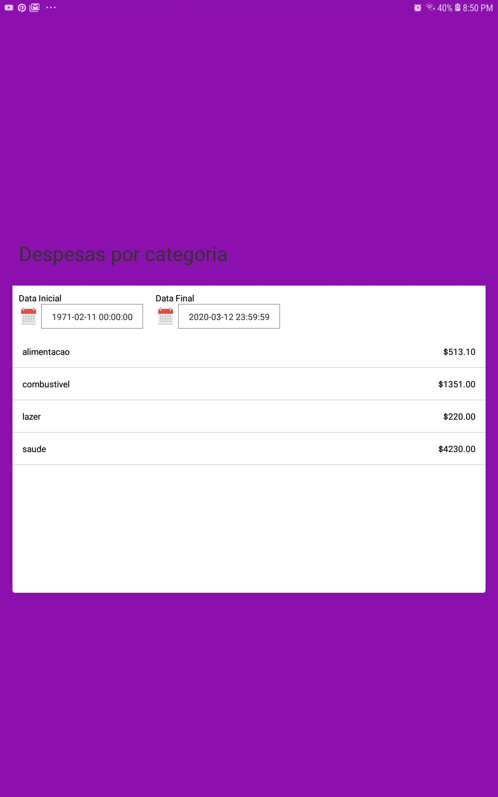

# Aplicativo Mobile - Atividade - FIAP - Pós-Graduação em Engenharia de Software

# Feature
O unicórnio escolhido foi o Nubank. 
Esse protótipo funcional adiciona uma funcionalidade de sumarização das contas por categoria
num determinado período de tempo escolhido pelo usuário. 

## Screenshots




# Pré-requisitos
- linux
- Android SDK
- node
- yarn
- react-native
- adb
- [backend desse app - microserviço]( https://github.com/dvriesman/fiap-nubank-api)

# Para instalar as dependências
```
yarn install
```

# Configurar o endereço do banckend
Editar o arquivo env.js localizado na pasta src.
Alterar a variável BACKENDAPI = 'http://192.168.0.19:8080/listSpending' conforme o endereço e porta
da máquina onde rodar o backend. 

**Lembrando que não pode ser localhost, pois o react-native roda no celular/tablet e vai acessar o backend rodando no computador**

# Iniciar o react-native
```
react-native start
```

# Para instalar no dispositivo mobile/tablet 
- Plugar um celular cujo modo Desenvolvedor esteja habilitado na porta USB.
- Confirmar que foi identificado através do comando:

```
adb devices
```
- Instalar no dispositivo:
```
react-native run-android
```


